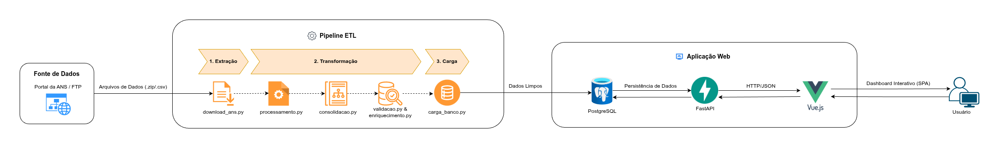
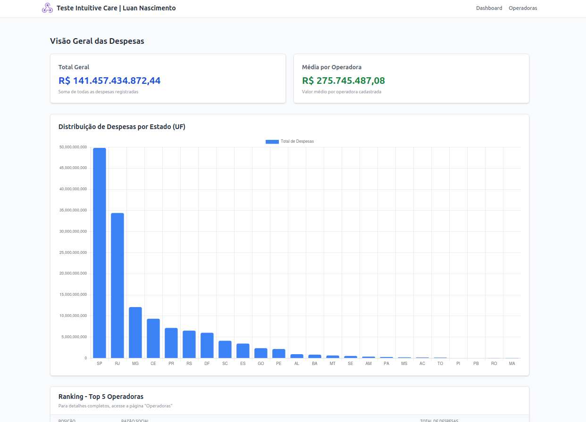
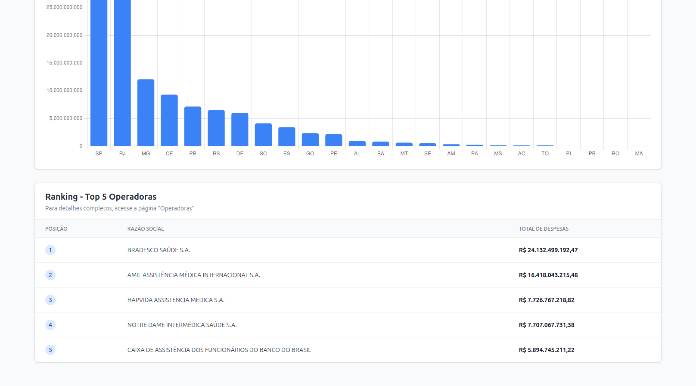
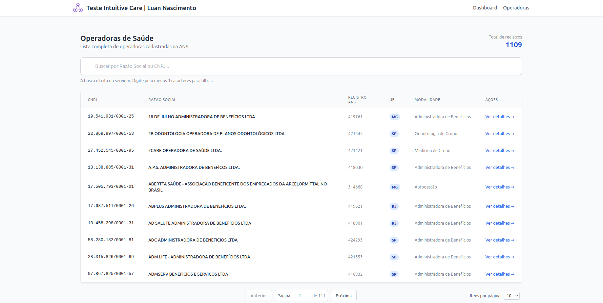
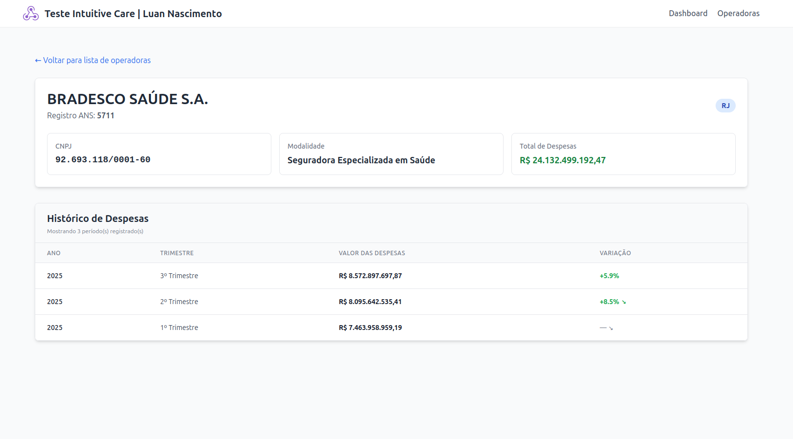

# Teste de Desenvolvimento de Software da Intuitive Care




Este repositório contém a solução completa para o desafio técnico, abrangendo desde o processamento de dados da ANS (ETL) até a visualização em um Dashboard interativo.

### Índice
- [Tarefa 1: Integração e ETL](#decisões-técnicas-da-tarefa-1---teste-de-integração-com-api-pública)
- [Tarefa 2: Qualidade e Transformação](#decisões-técnicas-da-tarefa-2---teste-de-transformação-e-validação-de-dados)
- [Tarefa 3: Banco de Dados](#decisões-técnicas-da-tarefa-3---teste-de-banco-de-dados-e-análise)
- [Tarefa 4: API e Frontend](#decisões-técnicas-da-tarefa-4---teste-de-api-e-interface-web)
- [Imagens do Dashboard](#dashboard-de-estatísticas)
- [Documentação da API](#44-documentação-da-api)
- [Arquivos ZIPs para Avaliação](#arquivos-zips-para-avaliação)
- [Diferenciais do Projeto](#diferenciais-e-qualidade-de-código)
- [Tratamento de Regras de Negócios](#lógica-de-dados-e-tratamento-de-regras-de-negócios)
- [Como Executar](#como-executar)

## Decisões Técnicas da Tarefa 1 - TESTE DE INTEGRAÇÃO COM API PÚBLICA

O padrão ETL foi construido priorizando flexibilidade, simplicidade e resiliência. Abaixo estão os **Trade-off**:

### 1.1. Acesso aos Dados Abertos da ANS via Web Scraping
Utilizei a Abordagem de criar um Crawler Recursivo (`etl/download_ans.py`), devido a estrutura do servidor FTP da ANS variar muito. O script navega dinamicamente por diretórios e subdiretórios para encontrar os arquivos ZIP, evitando hardcoding de URLs. Para obter resiliência às variações, é implementada proteção contra loops de diretórios ("Parent Directory") e tratamento de exceções de SSL.

Exemplo da Lógica central de navegação e extração:

```python
for link in soup.find_all('a', href=True):
    href = link['href']
    url_completa = urljoin(url_atual, href)

    # Se for um arquivo zip e conter ano (ex: 2023), adiciona à lista
    if '.zip' in href.lower() and re.search(r'202\d', href):
        zips_encontrados.append(url_completa)
    
    # Se a pasta for válida, executa a recursão (DFS)
    elif href.endswith('/') and href not in ['../', './']:
        sub_zips = buscar_zips_recursivamente(url_completa, nivel + 1)
        zips_encontrados.extend(sub_zips)
```

### 1.2. Processamento de Arquivos
Optei pelo **Processamento Incremental**. Dessa forma, o script `etl/processamento.py` processa um arquivo trimestral por vez (`Open -> Transform -> Append -> Close`). Isso garante que o pipeline rode com consumo de RAM baixo e constante (O(1)), independentemente do volume histórico de dados, evitando estouro de memória (OOM).
Também implementei uma trava de duplicidade, o script identifica arquivos que referenciam o mesmo período (ex: "1T2023.zip" e "Cópia de 1T2023.zip") e processa apenas o primeiro, evitando duplicação de dados na origem.

Exemplo da pipeline de leitura e escrita incremental (Append Pattern):

```python
with zipfile.ZipFile(caminho_zip, 'r') as z:
    # Carrega apenas o arquivo atual na memória
    with z.open(nome_arquivo_interno) as f:
        df = carregar_dataframe_robusto(f, ...)
        
        # ... Aplicação de filtros e regras de negócio ...

        # Despeja no disco imediatamente (mode='a') e libera a RAM
        modo = 'w' if primeiro_arquivo else 'a'
        df_final.to_csv(ARQUIVO_SAIDA, mode=modo, header=primeiro_arquivo, index=False)
```

### 1.3. Consolidação e Tratamento de Inconsistências
Como os CSVs brutos não possuem coluna de data confiável, o `Trimestre` e `Ano` são extraídos via **Regex** diretamente do nome do arquivo original (`1T2025.zip`). No cruzamento com o CADOP, optei por um **Left Join** (priorizando as Despesas). Dessa forma, manter a integridade financeira é prioritário. Se uma operadora tem despesas mas não está no cadastro, ela aparece como "DESCONHECIDA", mas o valor contábil é preservado. Por fim, o arquivo CADOP passa por uma deduplicação prévia baseada no `Registro_ANS` para evitar a multiplicação de linhas no relatório final.

Exemplo da estratégia de Join visando integridade contábil:
```python
# Deduplicação preventiva da tabela dimensional (Cadop)
df_cadop.drop_duplicates(subset=['reg_ans'], inplace=True)

# Cruzamento (Left Join), prioriza a tabela da esquerda (Despesas). Se não achar a operadora, mantém o dado.
df_final = pd.merge(df_despesas, df_cadop, on='reg_ans', how='left')

# Tratamento de Missing Data
df_final['RazaoSocial'] = df_final['RazaoSocial'].fillna("DESCONHECIDA")
```

## Decisões Técnicas da Tarefa 2 - TESTE DE TRANSFORMAÇÃO E VALIDAÇÃO DE DADOS

Esta etapa focou na garantia de qualidade (Data Quality), enriquecimento e agregação estatística.

### 2.1. Estratégia de Validação (Data Quality)
Encontrei inconsistências como CNPJs com dígitos verificadores inválidos e valores negativos (estornos contábeis). Minha decisão foi usar  **Flagging**. Em vez de excluir registros inválidos (o que geraria perda de integridade financeira no balanço), optei por criar uma coluna `status_auditoria`. Registros inválidos são mantidos no cálculo financeiro, mas sinalizados para revisão posterior.

Exemplo de uso do Flagging
```python
df['check_cnpj'] = df['CNPJ'].apply(validar_cnpj_matematico)
df['check_valor'] = df['ValorDespesas'] > 0

# Estratégia de "Soft Validation" (Flagging)
# Em vez de excluir linhas (df.drop), consolida os erros em metadados.
def definir_status(row):
    erros = []
    if not row['check_cnpj']: erros.append("CNPJ_INVALIDO")
    if not row['check_valor']: erros.append("VALOR_INVALIDO")
    
    return "OK" if not erros else "; ".join(erros)

df['status_auditoria'] = df.apply(definir_status, axis=1)
```

### 2.2. Enriquecimento e Join
Foi necessário cruzar as despesas com o cadastro de operadoras usando o CNPJ como chave. Como uma forma mais simplificada e rápida para o Join, decidi usar o In-Memory Hash Join (Pandas Merge). Dado o volume final (~80k linhas na tabela fato e ~1k na dimensão), o uso de engines distribuídas (Spark) seria exagerado e provavelmente me custaria tempo. O Pandas gerencia esse volume em milissegundos com baixo custo de memória. Para o tratamento de falhas, o arquivo Cadop foi deduplicado mantendo a primeira ocorrência (`keep='first'`) para evitar o erro de "Fan-out" durante o cruzamento. E para o LEFT JOIN, priorizei a tabela de Despesas. Operadoras sem cadastro ativo no Cadop não são descartadas, mas sim preenchidas como "DESCONHECIDA" para preservar o valor contábil total.

```python
df_despesas['CNPJ_KEY'] = df_despesas['CNPJ'].apply(limpar_cnpj_join)
df_cadop['CNPJ_KEY'] = df_cadop['CNPJ'].apply(limpar_cnpj_join)

# Remove duplicatas mantendo a primeira ocorrência para impedir 
# a multiplicação de linhas (Fan-out) no Join.
df_cadop = df_cadop.drop_duplicates(subset=['CNPJ_KEY'], keep='first')

df_final = pd.merge(df_despesas, cols_cadop, on='CNPJ_KEY', how='left')

# Tratamento de 'Sem Match' (Dados Faltantes)
cols_novas = ['RegistroANS_Novo', 'Modalidade', 'UF']
for col in cols_novas:
    df_final[col] = df_final[col].fillna("DESCONHECIDO")
```

### 2.3. Agregação e Estatística
O cálculo de média seguiu a regra de negócio de dois níveis: Soma das despesas por trimestre (visão temporal) e Média e Desvio Padrão calculados sobre os totais trimestrais (visão por entidade).
Para a ordenação, eu escolhi o algoritmo **QuickSort** (nativo via `sort_values`). Após a agregação, o dataset é reduzido para nível de operadora (< 1.000 linhas). Ordenação em memória é a abordagem mais eficiente (Complexidade O(N log N)) para este volume.

```python
df_trimestral = df.groupby(['RazaoSocial', 'UF', 'Ano', 'Trimestre'])['ValorDespesas'].sum().reset_index()
df_trimestral.rename(columns={'ValorDespesas': 'TotalTrimestre'}, inplace=True)

# Calcula Média e Desvio Padrão baseados nos totais trimestrais.
df_agregado = df_trimestral.groupby(['RazaoSocial', 'UF']).agg(
    Valor_Total=('TotalTrimestre', 'sum'),
    Media_Trimestral=('TotalTrimestre', 'mean'),
    Desvio_Padrao=('TotalTrimestre', 'std')
).reset_index()

# Tratamento de NaN para operadoras com apenas um trimestre
df_agregado['Desvio_Padrao'] = df_agregado['Desvio_Padrao'].fillna(0.0)

# Ordenação (In-Memory QuickSort)
df_agregado.sort_values(by='Valor_Total', ascending=False, inplace=True)
```

## Decisões Técnicas da Tarefa 3 - TESTE DE BANCO DE DADOS E ANÁLISE

Esta etapa consistiu na modelagem, carga e análise de dados utilizando **PostgreSQL** (via Docker).

### 3.1 e 3.3. Carga, Encoding e Agregação
Devido à arquitetura containerizada (Docker), a carga de dados via `LOAD DATA INFILE` nativo apresentaria complexidade de permissões de volume. Como abordagem, usei o Script Python (`etl/carga_banco.py`) utilizando `SQLAlchemy` e `Pandas`. O qual permite tratamento prévio de inconsistências, como limpeza de `NULLs`, conversão de encoding `ISO-8859-1` para `UTF-8`, e caso o encoding falhe, faz fallback para CP1252 (padrão legado Windows/ANS). Isso garante que apenas dados sanitizados entrem no banco.
E também, o script realiza uma SOMA (Group By) dos lançamentos contábeis por Operadora/Trimestre antes de inserir na tabela Fato. Isso garante que a tabela de banco reflita o valor total do período, alinhando os valores do Dashboard com o Histórico Detalhado.

Exemplo para a sanitização antes da carga do banco de dados
```python
df['valor'] = pd.to_numeric(df['valor'], errors='coerce').fillna(0)

# Mapea explicitamente para Numeric(15, 2) no banco.
# O uso de FLOAT é evitado para garantir precisão financeira.
df.to_sql('fato_despesas', engine, if_exists='replace', index=False,
          dtype={'valor': Numeric(15, 2), 'ano': Integer(), 'trimestre': Integer()})

# Como o Pandas não cria índices nativamente, executei DDL 
# manual para otimizar as queries analíticas subsequentes.
with engine.connect() as conn:
    conn.execute(text("CREATE INDEX IF NOT EXISTS idx_fato_cnpj ON fato_despesas(cnpj_origem);"))
    conn.execute(text("CREATE INDEX IF NOT EXISTS idx_fato_tempo ON fato_despesas(ano, trimestre);"))
    conn.commit()
```

### 3.2. Modelagem de Dados e Trade-offs
Para atender aos requisitos de performance e integridade, tomei as seguintes decisões:

#### **A. Normalização: Opção Tabelas normalizadas separadas**
O modelo foi separado em **Fato** (`fato_despesas`) e **Dimensão** (`dim_operadoras`).
Os Dados cadastrais são mutáveis. A normalização garante que uma alteração cadastral seja feita em um único registro, refletindo automaticamente em todas as transações. A tabela fato possui ~76 mil registros. Repetir textos longos em cada linha aumentaria desnecessariamente o I/O de disco e o uso de memória.

#### **B. Tipos de Dados**
Para valores monetários, optei por **DECIMAL** em vez de `FLOAT` porque tipos de ponto flutuante (`FLOAT`) introduzem erros de arredondamento (ex: `0.1 + 0.2 != 0.3`) inaceitáveis para dados financeiros.
Para datas, colunas `ano` e `trimestre` foram tipadas como Inteiros porque a granularidade da análise é trimestral. Usar `DATE` exigiria funções de extração (`EXTRACT(YEAR FROM...)`) em todas as queries, reduzindo a performance de índices sem ganho funcional.

#### **C. Performance e Índices**
Para garantir a velocidade das queries analíticas, foram criados índices B-Tree explícitos:
* `idx_fato_cnpj`: Acelera o JOIN entre a Fato e a Dimensão.
* `idx_fato_tempo`: Acelera filtros temporais (`WHERE ano = X`).
* `PK (reg_ans)`: Garante unicidade e integridade referencial na dimensão.

Exemplo para a modelagem no banco de dados
```python
# Numeric(15,2) é essencial para evitar erros de arredondamento em dados financeiros.
# Integer é melhor performance de indexação que Date para esta granularidade.
type_fato = {
    'valor': Numeric(15, 2),
    'ano': Integer(),     
    'trimestre': Integer(),
    'cnpj_origem': String(20)
}

df.to_sql('fato_despesas', engine, if_exists='replace', index=False, dtype=dtype_fato)

# O Pandas não gerencia chaves ou índices. Executei DDL manual para:
# Definir Primary Key na dimensão.
# Criar índices B-Tree para acelerar Joins e Filtros Temporais.
with engine.connect() as conn:
    conn.execute(text("ALTER TABLE dim_operadoras ADD PRIMARY KEY (reg_ans);"))

    conn.execute(text("CREATE INDEX IF NOT EXISTS idx_fato_cnpj ON fato_despesas(cnpj_origem);"))
    
    conn.execute(text("CREATE INDEX IF NOT EXISTS idx_fato_tempo ON fato_despesas(ano, trimestre);"))
```
### 3.4. Queries Analíticas (`sql/queries.sql`)
As queries foram desenvolvidas focando em legibilidade e performance.

Para o crescimento trimestral, utilizei Window Functions (FIRST_VALUE) com ordenações opostas (ASC/DESC). Isso permite capturar o primeiro e o último registro de cada operadora em uma única passagem (Scan), eliminando a necessidade de múltiplos self-joins custosos. Para a distribuição geográfica, usei agregação simples com tratamento de divisão por zero (NULLIF). Por fim, optei por CTEs (Common Table Expressions) para isolar o cálculo da média de mercado, tornando o código mais legível e modular comparado a subqueries aninhadas.

```sql
WITH limites_temporais AS (
    -- Uso de Window Functions evita Self-Joins.
    -- Busca o primeiro e último valor manipulando apenas a ordem (ASC/DESC) na partição.
    SELECT DISTINCT
        razao_social,
        FIRST_VALUE(total_trimestre) OVER (PARTITION BY ... ORDER BY ... ASC) as valor_inicial,
        FIRST_VALUE(total_trimestre) OVER (PARTITION BY ... ORDER BY ... DESC) as valor_final
    FROM despesas_trimestrais
)
SELECT 
    razao_social,
    -- NULLIF trata operadoras que iniciaram zeradas, evitando erro de "Division by Zero" que derrubaria a 
    --- execução do relatório.
    ROUND(((valor_final - valor_inicial) / NULLIF(valor_inicial, 0)) * 100, 2) as crescimento_pct
FROM limites_temporais
WHERE valor_inicial > 0
ORDER BY crescimento_pct DESC
LIMIT 5;
```
## Decisões Técnicas da Tarefa 4 - TESTE DE API E INTERFACE WEB
Esta etapa detalha as minhas escolhas de arquitetura para a API e Interface Web, justificando cada decisão técnica com base nos requisitos de performance, manutenção e experiência do usuário (UX).

### 4.1 e 4.2. Backend (FastAPI + SQLAlchemy)
A API foi construída seguindo os princípios RESTful, servindo como interface entre os dados processados e o frontend.

Optei pelo FastAPI em vez do Flask devido à sua natureza assíncrona (ASGI) nativa e performance superior. A integração automática com Pydantic garante validação de dados robusta ("type safety") e a geração automática da documentação (Swagger UI) acelera o desenvolvimento. O Flask exigiria múltiplas bibliotecas externas para atingir o mesmo nível de funcionalidade.

Para tabelas administrativas onde o usuário precisa "pular" para uma página específica, a paginação por Offset (`page`, `limit`) é a mais intuitiva. Embora `Cursor-based` seja mais performático para "scroll infinito", o volume de dados atual é perfeitamente gerenciado pelo banco com Offset sem problemas.

Optei por não implementar cache (Redis) neste momento. Como a carga de dados é trimestral, a "pré-agregação" já foi realizada parcialmente durante a etapa de ETL. Além disso, a criação de índices B-Tree nas colunas de agrupamento (`ano`, `cnpj`) torna a execução da query sub-segundo, eliminando a complexidade de manter e invalidar cache externo.

A API retorna um "envelope": `{ data: [...], total: 100, page: 1, limit: 10 }`. Enviar apenas o array de dados impediria o Frontend de saber o número total de páginas disponíveis para renderizar os botões de paginação corretamente.

Exemplo dos endpoints:
```python
app.include_router(operadoras.router)
app.include_router(estatisticas.router)

@app.get("/")
def read_root():
    return {"message": "API do Teste Intuitive Care está online!"}

@app.get("/health/db")
```

### 4.3. Frontend (Vue.js 3 + Tailwind)
A interface foi desenvolvida com Vue 3 (Composition API) e Vite, focando em reatividade, com Tailwind para estilização rápida e consistente.

A filtragem por Razão Social/CNPJ é enviada como query parameter para a API (`?search=bradesco`). Trazer todos os dados para o cliente aumentaria o tempo de carregamento inicial. Filtrar no servidor é a abordagem mais escalável.

Utilizei a Composition API para criar lógicas reutilizáveis. O uso de uma store global como Pinia/Vuex adicionaria complexidade desnecessária para uma aplicação onde o estado raramente é compartilhado entre rotas distantes. Props e Events foram suficientes.

A tabela renderiza apenas o número de linhas definido pelo `limit` (padrão 10), mantendo a árvore DOM leve. Não há necessidade de "Virtual Scrolling" complexo pois a paginação é feita no servidor.

Para o tratamento de erros e UX:
* **Loading:** Feedback visual ("Spinners") enquanto a Promise está pendente.
* **Erros:** Mensagens amigáveis (`v-if="error"`) em vez de alertas genéricos ou tela branca.
* **Empty States:** Mensagem explicativa ("Nenhum registro encontrado") para buscas vazias.

Demonstração da aplicação Fullstack:
### Dashboard de Estatísticas


### Ranking das Operadoras


### Tabela de Busca das Operadoras


### Detalhes da Operadora


### 4.4. Documentação da API
Conforme solicitado, uma coleção completa do Postman foi criada e versionada no repositório. Contêm exemplos de todas as rotas (`GET`), incluindo payloads de resposta e query parameters configurados.

Veja a coleção em docs: [Intuitive Care API Collection](./docs/intuitivecare_api_collection.json)


## Arquivos ZIPs para Avaliação

Os arquivos solicitados no edital podem ser acessados diretamente nos links abaixo:

* **Arquivo consolidado:** [consolidado_despesas.zip](./data/processed/consolidado_despesas.zip)
* **Arquivo agregado**: [teste_luan_nascimento.zip](./data/processed/teste_luan_nascimento.zip)
* **Todos os artefatos do processo ETL**: [pasta data](./data)


## Diferenciais e Qualidade de Código

Além dos requisitos obrigatórios, o projeto conta com implementações focadas em manutenibilidade e DX (Developer Experience):

* **Testes Automatizados:** Implementação de testes unitários e de integração utilizando `pytest`. Os testes cobrem desde a lógica de ETL (agregação e validação) até a integridade do banco de dados e endpoints da API.
* **Dockerização:** O ambiente de banco de dados está containerizado, facilitando o setup e garantindo isolamento.
* **Documentação Viva (Swagger):** A API possui documentação interativa gerada automaticamente (`/docs`), permitindo testar os endpoints diretamente pelo navegador.
* **Design Moderno:** Uso de Tailwind CSS para uma interface limpa e responsiva.

### Lógica de Dados e Tratamento de Regras de Negócios

Durante a análise dos dados da ANS, identifiquei alguns problemas na estrutura contábil que exigiram tratamentos específicos para garantir a consistência dos valores:

- **Filtragem Hierárquica (problema da Duplicidade):** O plano de contas da ANS é hierárquico (ex: Conta 4 engloba a 41, que engloba a 411). Somar todas as linhas contendo "Eventos" resultaria em valores duplicados ou triplicados (na casa dos trilhões). Então, fiz com que a pipeline filtre a conta sintética 411 (Eventos/Sinistros Conhecidos ou Avisados) ou suas variações, eliminando a "Conta Pai" e contas de Passivo para capturar apenas a despesa real do período.

- **Seleção de Colunas Temporais (problema do 1º Trimestre):** Os arquivos CSV contêm VL_SALDO_INICIAL e VL_SALDO_FINAL. Priorizei a extração da coluna VL_SALDO_FINAL porque no 1º Trimestre, o VL_SALDO_INICIAL é frequentemente zero. Utilizar a coluna incorreta faria com que os dados de Jan/Fev/Mar fossem ignorados.

- **Natureza dos Dados (YTD) e Cálculo de Deltas:** Os dados contábeis da ANS são reportados de forma acumulada (Year-to-Date). Ou seja, o valor do 3º Trimestre inclui a soma do 1º e 2º. Para apresentar a visão financeira real (quanto foi gasto em cada trimestre), implementei uma lógica de Cálculo de Delta na etapa de consolidação. O algoritmo agrupa os dados por Ano e Operadora, ordena cronologicamente e subtrai o valor do trimestre anterior (Valor Atual - Valor Anterior). Isso corrigiu a distorção dos dados brutos, permitindo que o Dashboard exiba a despesa trimestral real e não uma soma duplicada.


### Como Executar: 

**Pré-requisitos:** 
- Python 3.10+
- Node.js 16+
- PostgreSQL (Local ou Docker)

**1. Configuração do Ambiente e Banco de Dados:**

Crie um arquivo .env na raiz do projeto:

``` bash
    DB_HOST=localhost
    DB_NAME=postgres
    DB_USER=postgres
    DB_PASSWORD=postgres
```
Se tiver Docker instalado, suba um banco rapidamente:

```bash
docker run --name pg-test -e POSTGRES_PASSWORD=postgres -p 5432:5432 -d postgres:13
```

**2. Instalação das Dependências Python:**

``` bash
    # Cria um ambiente virtual
    python -m venv .venv
    source .venv/bin/activate  # Linux/Mac
    # .venv\Scripts\activate   # Windows

    # Instala bibliotecas
    pip install -r requirements.txt
```

**3. Execute o Pipeline ETL:**

**Opção A: Execução Automática (Recomendado):**
Utilize o script orquestrador que executa todas as etapas sequencialmente e trata erros:

``` bash
    python executa_pipeline.py
```

**Opção B: Execução Manual (Passo a Passo):**
Caso queira executar ou depurar cada etapa individualmente:

Tarefa 1: ETL e Consolidação

``` bash
    python -m etl.download_ans
    python -m etl.processamento
    python -m etl.consolidacao
```

Tarefa 2: Qualidade e Agregação

``` bash
    python -m etl.validacao
    python -m etl.enriquecimento
    python -m etl.agregacao
```

Tarefa 3: Banco de Dados e SQL
    
``` bash
    # Popula o banco PostgreSQL
    python -m etl.carga_banco
```

**4. Execução da Aplicação Web:**

Você precisará de dois terminais abertos simultaneamente.

Terminal 1: Backend (API):

``` bash
    # Inicia o servidor FastAPI na porta 8000
    uvicorn backend.src.main:app --reload
```
- Para o Swagger: http://localhost:8000/docs

Terminal 2: Frontend (Interface)

``` bash
    cd frontend

    # Instala dependências do Vue.js
    npm install

    # Roda o servidor de desenvolvimento
    npm run dev
```
- Acesse a Aplicação: http://localhost:5173

**5. Verificação e Testes Automatizados**

**Script de Teste Unificado para o ETL:**
Para garantir a integridade da aplicação, você pode rodar a os testes completo.

**Opção A: Script de Teste Unificado (Recomendado):**
Este script executa automaticamente os testes de ETL e Validação.
``` bash
    python executa_testes.py
```
**Opção B: Testes de Integração da API:**
Para testar especificamente os endpoints do Backend.
``` bash
    python -m pytest backend/src/tests/test_api.py -v
```

**Artefatos Gerados:** os arquivos solicitados no teste estarão disponíveis em:

- **ETL:** ```data/processed/consolidado_despesas.zip```
- **Agregação:** ```data/processed/teste_luan_nascimento.zip```
